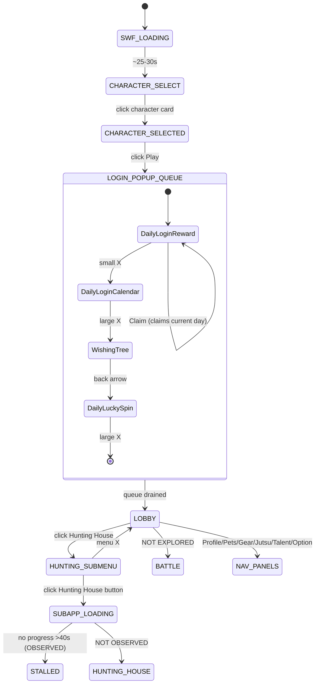

# Ninja Saga — UI Map (Phase 1: observation)

Observed live on 2026-08-21 against `https://ninjasaga.cc/play`, account `Tokiri` (Lv 57).
Everything below was seen on screen, not inferred. Items I could **not** observe are
explicitly marked; nothing in this document is guessed.

---

## 1. Rendering stack (this determines everything else)

The game is the **original Flash SWF running on Ruffle** (WASM + WebGL), not HTML/DOM:

```
page  https://ninjasaga.cc/play
 └── iframe (same-origin, ninjasaga.cc)   960 x 839 CSS
      └── <ruffle-player>  ── shadowRoot ── <canvas> 1920 x 1678 backing
```

* Ruffle `0.2.0-nightly.2026.1.14`, renderer **webgl**, WASM extensions ON.
* Boot SWF: stage 960x720, 24 fps, SWF v17 (a 10-frame preloader that then pulls
  the real `ninja_saga.swf` from the CDN).
* **Cold start ≈ 25–30 s** from navigation to Select Character. The state machine
  needs a loading state with a timeout well above this.

### Consequence: template matching is the only option
Ruffle rasterises the SWF's own vector art into one canvas. There are **no DOM
elements inside the game** — no buttons, no labels, nothing queryable. Screenshot →
match → click is not a workaround here, it is the only available interface.

### Consequence: templates are OS-portable
Because Ruffle rasterises in WASM rather than using macOS text/DOM rendering, the same
Ruffle version at the same canvas size yields near-identical pixels on Linux. Templates
cut here should survive a move into a container.

---

## 2. Coordinate geometry — measured, not assumed

Captured with viewport **1728 x 851 CSS**, `devicePixelRatio = 2`:

| Layer | Value |
|---|---|
| Top viewport (CSS) | 1728 x 851 |
| MCP screenshot | 1568 x 772 → **0.9074 x CSS** |
| Game iframe in top doc | (379, 13), 960 x 839 CSS |
| Canvas CSS → backing | 960x839 → 1920x1678 (**dpr 2**) |
| screenshot px → native px | **x 2.204** |

```
iframe_local_css = screenshot_xy / 0.9074 - (379, 13)
native_canvas_px = iframe_local_css * 2
```

Verified empirically: a click issued at screenshot (743, 245) arrived at the canvas
listener as `clientX/Y = (441, 257)`; the formula predicted (439.8, 257.0). Within 1 px.

> **All pixel positions in this document are reference-only.** They are valid solely for
> the window geometry above. Resizing the browser rescales the canvas and invalidates
> every number here — which is exactly why the bot must detect and then click what it
> found, never hardcode. Positions are recorded to aid debugging, not for use as input.

### Input delivery is a solved problem
A probe on the Ruffle canvas confirmed injected events arrive as
`pointerdown / mouseup / click` with **`isTrusted: true`**, and the game responded
normally. This resolves the `pydirectinput` question: OS-level input synthesis is not
needed. (`pydirectinput` is also unusable here regardless — it executes
`ctypes.windll.user32.SendInput` at import time and is Windows-only.)

---

## 3. States

### S1 `SWF_LOADING`
* **Identifies by:** blank white game frame; `<ruffle-player>` present, canvas blank.
* **Elements:** none.
* **Exits:** → `CHARACTER_SELECT` after ~25–30 s.

### S2 `CHARACTER_SELECT`
* **Identifies by:** "Select Character" scroll banner; six character slots.
* **Elements:** occupied slot ("Tokiri / Level 57 / Male"); five `Create` buttons.
* **Exits:** click an occupied card → `CHARACTER_SELECTED`.
* ⚠️ Five `Create` buttons live here. Nothing should ever click them.

### S3 `CHARACTER_SELECTED`
* **Identifies by:** selected card gains a **yellow border**; `Play` and `Delete`
  appear at the panel foot.
* **Elements:** `Play` (screenshot 1088, 493) · `Delete` (screenshot 669, 493).
* **Exits:** `Play` → `LOGIN_POPUP_QUEUE`.
* 🛑 **`Delete` sits on the same row as `Play`, ~419 screenshot px to its left.** It
  destroys a character. Any config touching this screen must whitelist `Play` by
  template and never click by offset.

### S4 `LOGIN_POPUP_QUEUE` — **four stacked popups**
Login does not show one popup. It queues **four**, each revealed only by dismissing the
one in front. The bot needs a drain-loop ("while a dismiss control is visible, dismiss"),
not a single dismiss step.

| # | Popup | Identifies by | Action control | Dismiss control |
|---|---|---|---|---|
| 1 | Daily Login Reward | "Daily Login Reward" + Day1–Day5 chevrons | **`Claim`** (760, 430) | small ✕ (1146, 154) |
| 2 | Daily Login Calendar | month grid + "Daily Login Calendar" | milestone tiles (16/19/22/25/28/31) | large ✕ (1167, 100) |
| 3 | Wishing Tree | green tree + "Wishing Tree" | `Wish` (780, 624) | **back-arrow** (1174, 141) |
| 4 | Daily Lucky Spin | spin wheel + "ONCE A DAY" | `SPIN` (866, 566) | large ✕ (1170, 108) |

Observed in popup 1: Day1 and Day2 carry green ticks (claimed), Day3 is current
(red tab + pointer), Day4/Day5 pending. Popup 4 showed a **"Day 7"** consecutive-login
counter with an escalating multiplier table (x1 → x6, max 15 days).

**Dismiss controls are not uniform** — small ✕, large ✕, and a back-arrow all appear.
This is why `tpl/` carries a set rather than one `close.png`.

### S5 `LOBBY` (village hub)
* **Identifies by:** the six opaque bottom-bar icons (Profile · Pets · Gear · Jutsu ·
  Talent · Option) and the `NINJA SAGA` logo, bottom-left. **These are the reliable
  anchors** — opaque, high-contrast, fixed.
* **HUD read:** Lv 57 · HP 2574/2574 · CP 2340/2340 · XP 434522/640684 ·
  Team 0/2 · 2,229,181 gold · 868 tokens · "3 Lv to go" (Jounin → Special Jounin) · Season 08.
* **Village destinations (semi-transparent labels):** Cooperatives, Academy, Shop, Clan,
  Headquarters, Mission Room, Hunting House, Arena, Pet Centre, Recruit Friends, Talent,
  Battle, Package x2.
* **Right icon rail:** 5 icons (backpack, bag "6", calendar, red fortune bag, mail).
* **Bottom-right:** `Invite Reward` — this is a *friend-invite* reward, **not** the daily
  login reward. The daily popups appear to be login-triggered only; no lobby button was
  found that reopens them.
* **Exits:** click `Hunting House` → `HUNTING_SUBMENU`; nav icons → panels (not mapped).

### S6 `HUNTING_SUBMENU`
* **Identifies by:** brown panel with three green buttons.
* **Elements:** `Hunting House` (795, 200) · `Eudemon Garden` (795, 271) ·
  `Materials Market` (795, 337) · menu ✕ (919, 163).
* **Exits:** `Hunting House` → `SUBAPP_LOADING`.

### S7 `SUBAPP_LOADING`
* **Identifies by:** full-black frame, dark silhouette, "Loading…" + a percentage.
* **Note:** the **percentage digits change**, so `tpl/loading_text.png` deliberately
  contains only the word "Loading…".

### S8 `HUNTING_HOUSE` — ⛔ **NOT OBSERVED**
The Hunting House sub-app **stalled at "Loading… 3 %"** and never advanced across
~40 s of waiting. The console showed no network error, so this is a stall rather than
slowness. Whether this is a Ruffle limitation on that sub-SWF, a CDN issue, or a
transient fault is **unresolved**. Everything downstream — hunting UI, and combat
reached through it — is therefore unmapped.

### S9 `BATTLE / COMBAT` — ⛔ **NOT EXPLORED (deliberate)**
Not attempted. Entering combat spends stamina and risks a real loss on a Lv 57
character, which is a material action on your account rather than observation. It also
sits behind the stalled loader. Needs your explicit go-ahead.

---

## 4. State diagram



---

## 5. Templates (`tpl/`)

All cut at **native 2x canvas resolution as lossless PNG** — the region-zoom path reads
the real canvas pixels (verified: 2.204x = 1/0.9074 x 2), not the downscaled JPEG.
Each was audited for background contamination.

| File | Size (px) | Purpose | Notes |
|---|---|---|---|
| `claim_daily.png` | 290x104 | **Phase 3/4 target** | clean; stable brown modal bg |
| `close_popup_x.png` | 60x60 | dismiss, small | disc ≈59px; blue bleed removed |
| `close_popup_x_menu.png` | 80x80 | dismiss, village menu | disc ≈63px; ~7% off the above |
| `close_popup_x_large.png` | 140x138 | dismiss, large | disc ≈136px; **~2.3x — own template** |
| `close_popup_back_arrow.png` | 124x124 | dismiss, Wishing Tree | 3rd control shape |
| `day_claimed_check.png` | 117x120 | day already claimed | re-cut to exclude coin + digit |
| `day_current_pointer.png` | 84x41 | current-day marker | day-agnostic |
| `wish_btn.png` | 326x112 | Wishing Tree action | once/day |
| `spin_btn.png` | 310x152 | Lucky Spin action | once/day |
| `loading_text.png` | 234x66 | loading interstitial | excludes the % digits |
| `lobby_logo.png` | 216x128 | LOBBY anchor | opaque, fixed |
| `nav_profile/pets/gear/jutsu/talent/option.png` | ~100x94 | LOBBY anchor set | best anchors available |
| `hunting_house_btn.png` | 516x102 | submenu entry | |
| `invite_reward_btn.png` | 182x164 | lobby, bottom-right | *not* the daily reward |

**Quarantined (underscore prefix = do not use as-is):**

| File | Why |
|---|---|
| `_day_current_tab_DAYSPECIFIC.png` | contains the glyph "Day3" — stops matching tomorrow |
| `_weak_hunting_house_label.png` | semi-transparent over village art (walking NPCs, seasons) |
| `_weak_battle_label.png` | same problem |

**Match thresholds are not yet set.** Nothing here has been run through
`cv2.matchTemplate`, so any number would be invented. Calibrating per-template
thresholds against the saved references in `ref/raw/` is Phase 2 work.

---

## 6. Perception notes

1. **Colour masks beat template matching for some things.** The claimed-day tick
   segments cleanly on `G>190, 110<R<215, B<130` — the two claimed days returned 3318
   and 3323 px, nearly identical. Counting green blobs is a more robust
   "did the claim land?" check than matching a tick template.
2. **Derive the current day from position, not pixels.** The red current-day tab
   segments on `R>140, G<85, B<80`, but its glyph is day-specific. Take the mask's
   x-centroid and map it to a day column instead.
3. **Two close-button scale classes** (≈60px and ≈136px). `matchTemplate` is not
   scale-invariant; either keep both templates or match multi-scale.
4. **Avoid semi-transparent text labels** as templates — the art behind them moves.
5. **The console is noisy and lies.** The game logs `Out :: Error :: Main :: initButton`
   lines that are not errors. Any log-based health check would false-alarm on these.

---

## 7. Risks and open items

| # | Item | Status |
|---|---|---|
| 1 | **Ruffle sleeps when the tab is not active** — its render loop is `requestAnimationFrame`, which Chrome pauses for hidden tabs and occlusion-marked windows. Mitigations to *test*: `--disable-backgrounding-occluded-windows`, `--disable-renderer-backgrounding`, `--disable-background-timer-throttling`, sole-tab-in-own-window, CDP `Page.setWebLifecycleState('active')`. | **Unresolved — measure in Phase 2** |
| 2 | Hunting House sub-app stalls at 3% | Unresolved |
| 3 | Combat unmapped | Needs go-ahead |
| 4 | Canvas size follows window size; resizing invalidates every template | Pin window geometry in Phase 4 |
| 5 | **The SWF request URL carries a live session token** (`fb_at=sid_ns_…` + signature) and lands in the console. The Phase 2 cycle logger must never capture page URLs or console output, or logs become credential-bearing. | Design constraint |
| 6 | Daily popups look login-triggered only; no lobby re-open button found | Phase 4 testing may need a fresh login |

---

## 8. Deliberately not clicked

`Claim`, `Wish`, and `SPIN` were all left untouched. Each is a once-per-day,
irreversible action on a real account, and **Day 3's reward is still pending** — it is
worth more as a live end-to-end fixture for Phase 4 than as a mapping side effect.
